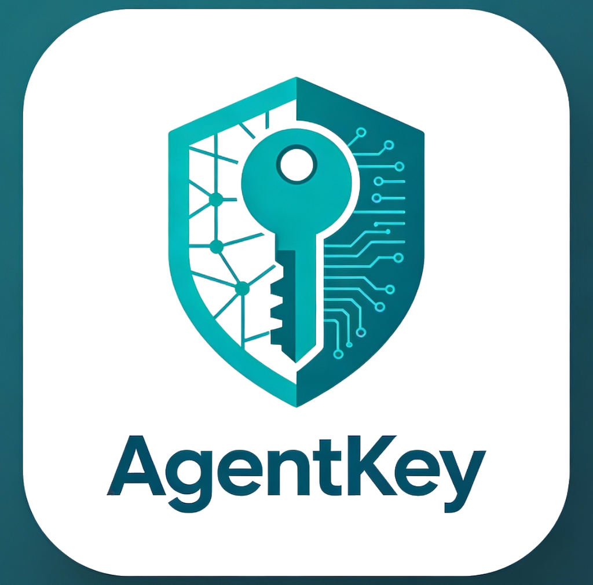

# AgentKey

<p align="center">
  
</p>

<p align="center">
  <strong>Secure Credential Management for AI Agents</strong>
</p>

<p align="center">
  <a href="#features">Features</a> •
  <a href="#quick-start">Quick Start</a> •
  <a href="#sdk">SDK</a> •
  <a href="#api-reference">API Reference</a> •
  <a href="#architecture">Architecture</a>
</p>

---

## Overview

AgentKey is a **centralized credential management platform** specifically designed for AI agents. It provides a secure, production-ready environment for storing, rotating, and accessing credentials using industry-standard encryption and short-lived ephemeral tokens.

### Why AgentKey?

AI agents often need access to multiple external services (OpenAI, AWS, databases, etc.) but managing these credentials securely is challenging:

- **Security Risk**: Hardcoding secrets in agent code or environment variables is dangerous
- **No Audit Trail**: Who accessed what credential and when?
- **No Rotation**: Secrets stay the same forever, increasing exposure risk
- **No Central Control**: Credentials scattered across different systems

**AgentKey solves these problems** by providing a centralized, encrypted vault that agents access via short-lived tokens.

## Features

### 🔐 Secure Credential Storage
- AES-256-GCM encryption at rest
- Short-lived ephemeral JWT tokens for access
- Credentials never exposed in logs

### 🤖 Agent Management
- Create dedicated identities for each AI agent
- Multiple API keys per agent with expiration
- Granular access controls

### 🔄 Credential Rotation
- Manual rotation via dashboard
- Programmatic rotation via SDK
- Version history for rollback

### 📊 Audit Logs
- Full access history
- IP address tracking
- Event filtering and search

### 🎨 Modern Dashboard
- React-based intuitive UI
- Real-time statistics
- Team collaboration features

### 📦 Python SDK
- Simple credential retrieval
- CRUD operations for credentials
- Async support

## Quick Start

### Prerequisites
- Docker and Docker Compose
- Git

### Installation

```bash
# Clone the repository
git clone https://github.com/YASSERRMD/agent-key.git
cd agent-key

# Copy environment file
cp .env.example .env

# Start all services
docker-compose up -d

# Access the dashboard
open http://localhost:3000
```

### Create Your First Agent

1. **Sign up** at `http://localhost:3000/signup`
2. **Create an agent** (e.g., "my-ai-bot")
3. **Generate an API key** for the agent
4. **Add credentials** (e.g., OpenAI API key)
5. **Use the SDK** to access credentials

### Python SDK Usage

```bash
pip install agentkey
```

```python
from agentkey import AgentKey

# Initialize with your agent's API key
agent = AgentKey(
    api_key="ak_your_agent_api_key",
    base_url="http://localhost:8080"
)

# Get a credential value
openai_key = agent.get_credential_value("openai-key")
print(f"Retrieved: {openai_key[:10]}...")

# List all credentials
credentials = agent.list_credentials()
for cred in credentials["data"]:
    print(f"- {cred['name']} ({cred['credential_type']})")

# Update a credential
agent.update_credential("openai-key", "sk-new-key-value")

# Create a new credential
agent.create_credential(
    name="database-password",
    secret="super-secret-password",
    credential_type="database"
)
```

## SDK

### Python SDK

Full documentation: [sdk/python/README.md](sdk/python/README.md)

```bash
pip install agentkey
```

| Method | Description |
|--------|-------------|
| `get_credential_value(name)` | Get decrypted secret |
| `list_credentials()` | List all agent credentials |
| `create_credential(name, secret, ...)` | Create new credential |
| `update_credential(name, new_secret)` | Update existing secret |
| `delete_credential(name)` | Delete credential |

## API Reference

### Authentication
| Endpoint | Method | Description |
|----------|--------|-------------|
| `/api/v1/auth/register` | POST | User registration |
| `/api/v1/auth/login` | POST | User authentication |
| `/api/v1/auth/me` | GET | Get current user |

### Agents
| Endpoint | Method | Description |
|----------|--------|-------------|
| `/api/v1/agents` | GET | List all agents |
| `/api/v1/agents` | POST | Create new agent |
| `/api/v1/agents/{id}` | GET | Get agent details |
| `/api/v1/agents/{id}` | PATCH | Update agent |
| `/api/v1/agents/{id}` | DELETE | Delete agent |

### Credentials
| Endpoint | Method | Description |
|----------|--------|-------------|
| `/api/v1/agents/{id}/credentials` | GET | List agent credentials |
| `/api/v1/agents/{id}/credentials` | POST | Create credential |
| `/api/v1/credentials/{id}` | GET | Get credential details |
| `/api/v1/credentials/{id}` | PATCH | Update credential |
| `/api/v1/credentials/{id}` | DELETE | Delete credential |

### Tokens (SDK)
| Endpoint | Method | Description |
|----------|--------|-------------|
| `/api/v1/agents/{id}/credentials/{name}/token` | GET | Get ephemeral token |

### Configuration
| Endpoint | Method | Description |
|----------|--------|-------------|
| `/api/v1/credential-types` | GET | List credential types |
| `/api/v1/credential-types` | POST | Create custom type |
| `/api/v1/audit` | GET | View audit logs |
| `/api/v1/stats` | GET | Dashboard statistics |

## Architecture

### System Overview

```
┌─────────────────────────────────────────────────────────────────┐
│                         AgentKey                                │
├─────────────────────────────────────────────────────────────────┤
│                                                                 │
│   ┌──────────────┐     ┌──────────────┐     ┌──────────────┐   │
│   │   React UI   │────▶│  Rust API    │────▶│  PostgreSQL  │   │
│   │  Dashboard   │     │  (Actix-web) │     │   + Redis    │   │
│   └──────────────┘     └──────────────┘     └──────────────┘   │
│                              │                                  │
│                              ▼                                  │
│                    ┌──────────────┐                            │
│                    │  Python SDK  │                            │
│                    │  (Agents)    │                            │
│                    └──────────────┘                            │
│                                                                 │
└─────────────────────────────────────────────────────────────────┘
```

### Tech Stack

| Component | Technology |
|-----------|------------|
| **Backend** | Rust + Actix-web |
| **Database** | PostgreSQL 15 |
| **Cache** | Redis 7 |
| **Frontend** | React + Vite + TypeScript |
| **Styling** | TailwindCSS |
| **State** | Zustand |
| **SDK** | Python 3.8+ |

### Security Model

1. **Credentials Encrypted**: AES-256-GCM with per-credential AAD
2. **Access via Tokens**: Short-lived JWTs (5 min default)
3. **Agent Isolation**: Each agent can only access its own credentials
4. **Audit Trail**: All access logged with IP and timestamp

## Project Structure

```
agent-key/
├── src/                    # Rust backend
│   ├── handlers/           # HTTP request handlers
│   ├── services/           # Business logic
│   ├── models/             # Database models
│   └── middleware/         # Auth middleware
├── frontend/               # React dashboard
│   ├── src/
│   │   ├── components/     # UI components
│   │   ├── pages/          # Page layouts
│   │   ├── services/       # API clients
│   │   └── store/          # State management
├── sdk/
│   └── python/             # Python SDK
├── migrations/             # SQL migrations
├── docker-compose.yml      # Container orchestration
└── Dockerfile              # Backend container
```

## Development

### Running Locally

```bash
# Backend (Rust)
cargo run

# Frontend (React)
cd frontend && npm run dev

# Full stack (Docker)
docker-compose up -d
```

### Running Tests

```bash
# Backend tests
cargo test

# Frontend tests
cd frontend && npm test

# Python SDK tests
cd sdk/python && python -m pytest tests/
```

## Roadmap

- [ ] Automatic credential rotation
- [ ] Webhook notifications
- [ ] Multi-tenancy improvements
- [ ] TypeScript/Node.js SDK
- [ ] Go SDK
- [ ] SSO integration
- [ ] Kubernetes Helm chart

## Contributing

Contributions are welcome! Please read our contributing guidelines before submitting PRs.

1. Fork the repository
2. Create a feature branch
3. Commit your changes
4. Open a pull request

## License

This project is licensed under the **AgentKey Source Available License**.

**You MAY:**
- Use locally for personal, educational, or internal business purposes
- Self-host for your own applications
- Modify and contribute improvements

**You MAY NOT:**
- Offer as a SaaS, managed service, or hosted solution
- Provide access to third parties as a commercial service

See [LICENSE](LICENSE) for full terms.

---

<p align="center">
  Made with ❤️ for the AI Agent community
</p>
